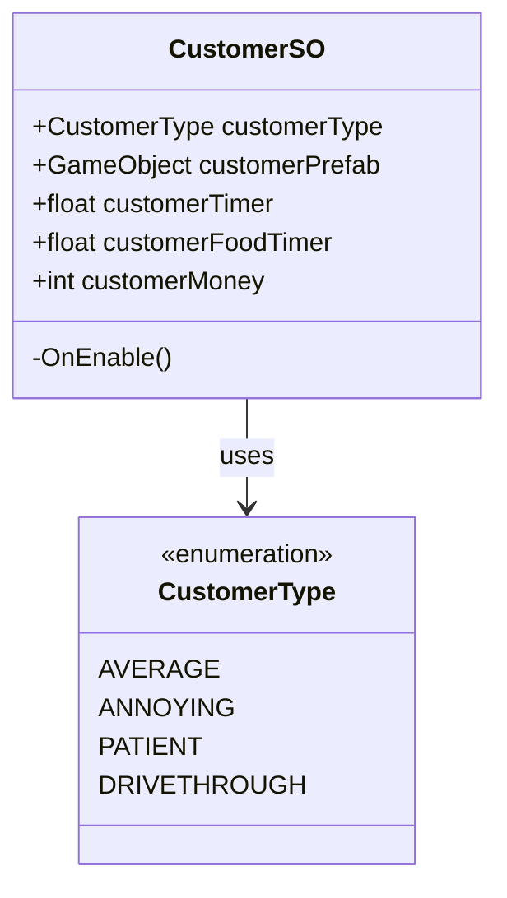
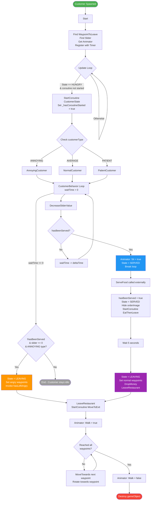
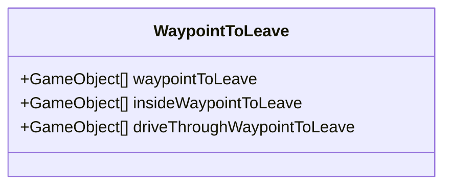
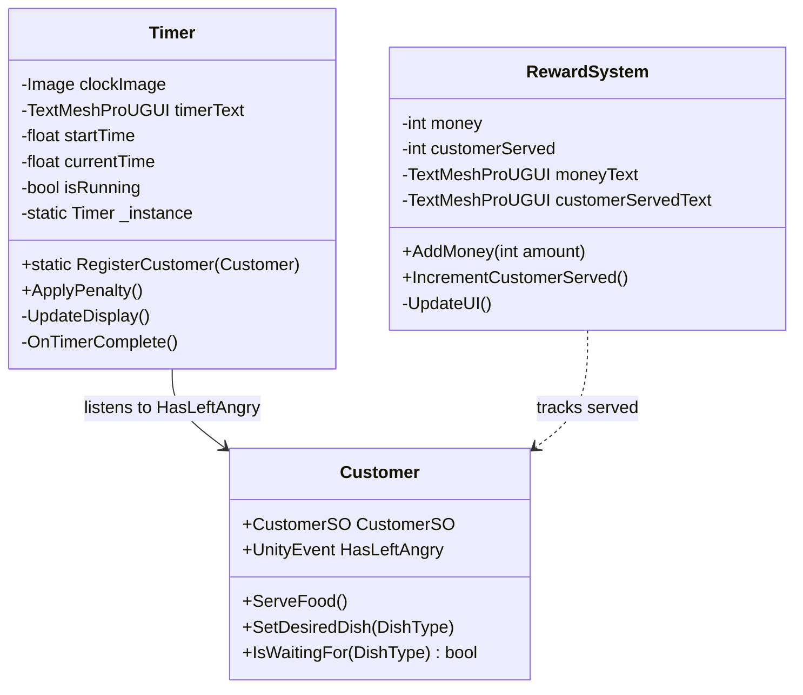
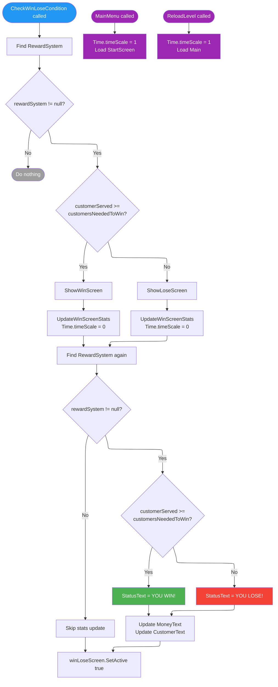
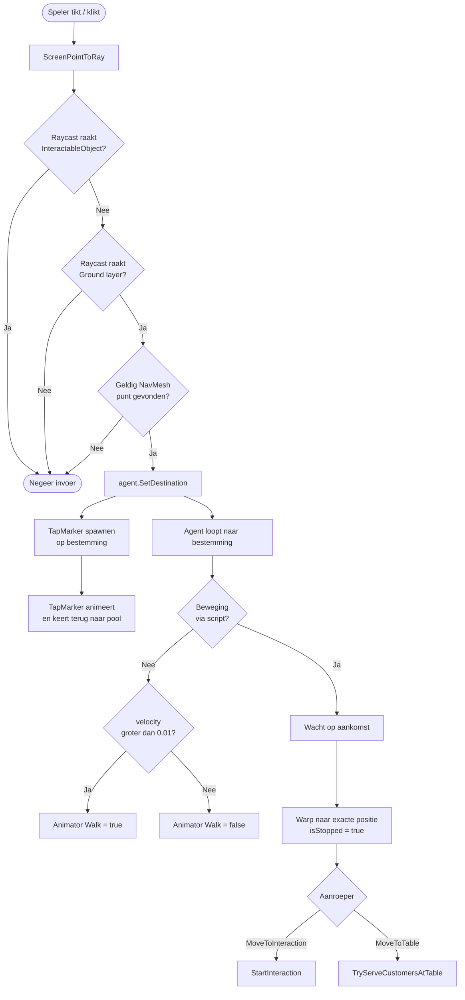
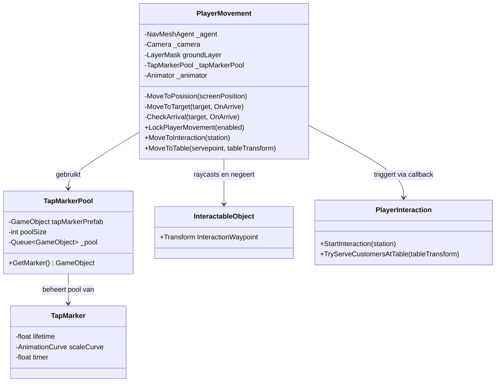
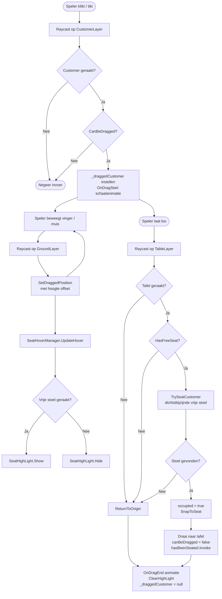
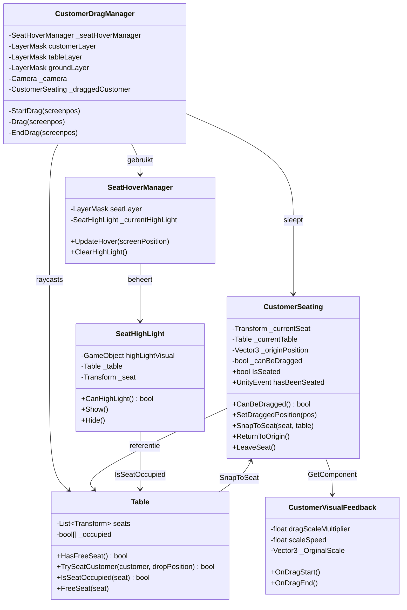

# AlienDiner

### Beschrijving
De opracht is dat we een Mobile game moeten maken waar 3 keuzes voor gegeven werden. We moeten de gekozen game maken met onze eigen style met bepaalde kriteria en we moeten onze eigen twist brengen aan het spel.

Wij kozen de game Diner Dash waar we als een serveerster spelen om klanten te serveren en dan geld te verdienen en blije klanten te hebben. Dus wij kozen ervoor om de ruimte te gebruiken als locatie en thema. Onze twist is dat je een Drive Through hebt die je in de gaten moet houden omdat daar een nieuw soort klant spawnt die ook eten wilt. De kriteria is dat wij 3 klanten soorten hebben, audio voor het spel, visuele feedback en een manier om eten te bereiden.

# Geproduceerde Game Onderdelen

Gino Schaap:
  * [Customer Types](https://github.com/TheGingino/AlienDiner/blob/Develop/AlienDinerDash/Assets/Scripts/Customer/CustomerSO.cs)
  * [Customer Spawning](https://github.com/TheGingino/AlienDiner/blob/Develop/AlienDinerDash/Assets/Scripts/Customer/CustomerSpawner.cs)
  * [DriveThrough Customer Spawning](https://github.com/TheGingino/AlienDiner/blob/Develop/AlienDinerDash/Assets/Scripts/Customer/DriveThroughCustomer.cs)
  * [Customer Behavior](https://github.com/TheGingino/AlienDiner/blob/Develop/AlienDinerDash/Assets/Scripts/Customer/Customer.cs)
  * [LevelTimer V2](https://github.com/TheGingino/AlienDiner/blob/Develop/AlienDinerDash/Assets/Scripts/Timer/LevelTimer.cs)
  * [WinLoseScreen](https://github.com/TheGingino/AlienDiner/blob/Develop/AlienDinerDash/Assets/Scripts/UI/WinLoseScreen.cs)
  * [Failure Consequence](https://github.com/TheGingino/AlienDiner/blob/Develop/AlienDinerDash/Assets/Scripts/Timer/Timer.cs)

Julie Jaasma:
  * [Cooking stations](https://github.com/TheGingino/AlienDiner/blob/Develop/AlienDinerDash/Assets/Scripts/Gerechten/InteractionManagers/InteractableObject.cs)
  * [Player Interactions](https://github.com/TheGingino/AlienDiner/blob/Develop/AlienDinerDash/Assets/Scripts/Gerechten/InteractionManagers/PlayerInteraction.cs)
  * [Station Clikcer](https://github.com/TheGingino/AlienDiner/blob/Develop/AlienDinerDash/Assets/Scripts/Gerechten/InteractionManagers/StationClickHandler.cs)
  * [Customer Order](https://github.com/TheGingino/AlienDiner/blob/Develop/AlienDinerDash/Assets/Scripts/Gerechten/OrderingFood.cs)
     

Nikki van Wijngaarden:
 * [PlayerMovement](https://github.com/TheGingino/AlienDiner/blob/Develop/AlienDinerDash/Assets/Scripts/Character/PlayerMovement.cs)
 * [TapMarker](https://github.com/TheGingino/AlienDiner/blob/Develop/AlienDinerDash/Assets/Scripts/Character/TapMarker.cs)
 * [tapMarkerPool](https://github.com/TheGingino/AlienDiner/blob/Develop/AlienDinerDash/Assets/Scripts/Character/TapMarkerPool.cs)
 * [CustomerDragManager](https://github.com/TheGingino/AlienDiner/blob/Develop/AlienDinerDash/Assets/Scripts/Customer/CustomerDragManager.cs)
 * [CustomerSeating](https://github.com/TheGingino/AlienDiner/edit/Develop/README.md)
 * [CustomerVisualFeedback](https://github.com/TheGingino/AlienDiner/blob/Develop/AlienDinerDash/Assets/Scripts/Customer/CustomerVisualFeedback.cs)
 * [Table](https://github.com/TheGingino/AlienDiner/blob/Develop/AlienDinerDash/Assets/Scripts/Customer/Table.cs)
 * [SeatHoverManager](https://github.com/TheGingino/AlienDiner/blob/Develop/AlienDinerDash/Assets/Scripts/Customer/SeatHoverManager.cs)
 * [SeatHighLight](https://github.com/TheGingino/AlienDiner/blob/Develop/AlienDinerDash/Assets/Scripts/Customer/SeatHighLight.cs)

Kiana Hiemstra:
  * Audio
  * [Timer V1](https://github.com/TheGingino/AlienDiner/blob/Develop/AlienDinerDash/Assets/Scripts/Timer/LevelTimer.cs)

Bo Bakker:
 * Character Models
 * Character animations
 * Drive through models
 *  all particle systems
 

Robin van Wandelen:
 * UI onderdelen
 * Booth models
 * Ramen/deur model
 

 Gui
 * Alle textures
 * Fries/milkshake model

Min van der Veen:
 * Blockout
 * Keuken Instrumenten
 * Outside enviroment
 * Props
   

## Customers and Customer SO by Gino Schaap

de CustomerSO is waar de soorten klanten worden in staan en er staat in hoeveel wachttijd hij heeft en hoeveel geld hij geeft.
In de Customer script staat zijn gedrag in. Wanneer hij kiest om weg te lopen of dat hij eten wilt en uiteindelijk weg gaat en geld achterlaat.

### Flowchart voor CustomerSO:

### Flowchart Customer by Gino Schaap

## Waypoints by Gino Schaap
De waypoints zijn er voor de klanten om het gebouw te kunnen verlaten. de eerste is voor een van de klanten soorten om het gebouw vervroegd te verlaten en de inside is voor de normale klant als ze klaar zijn met eten en de drive through voor de drivethrough klant om weg te gaan

### Class Diagram voor de Waypoints:

## Reward System by Gino Schaap
Dit is de manier hoe het hoeveelheid geld dat je hebt gemaakt en de hoeveelheid customers op je scherm staat die zich aanpast als er wat bij komt

## Failure Consequence
Als speler gaat er tijd van je klok af als een klant boos weg loopt als een negatief effect in het spel

## Timer V2 by Gino Schaap
De timer is er als een tijds limiet voor de speler zodat ze lichtelijk gehaast de klankten moeten serven en geld moeten verzamelen voordat de tijd voorbij is

### Class Diagram voor Timer V2 by Gino Schaap

## Win Lose Screen by Gino Schaap
Dit scherm komt naar boven als de timer om is en hij laat het verdiende geld zien, of je genoeg klanten hebt geserveerd en er staat of je hebt gewonnen of hebt verloren.

###

## PlayerMovement by Nikki van Wijngaarden

Een NavMesh based movementsysteem dat spelers overal op de grond laat klicken om daarnatoe te lopen, en ook kort laat zien waar je hebt geklickt.

#gifje?

## Flowchart — PlayerMovement

---

## classDiagram - PlayerMovement

## CustomerSeating by Nikki van Wijngaarden

Een drag-and-drop systeem waarmee customers kunt op pakken en neer zetten bij een tavel, waarna ze gaan zitten op de stoel dichts bij waar je ze neer hebt gezet. Met visual feedback op de customer bij het oppakken en bij het hoveren boven een stoel.

#gifje?

## Flowchart - CustomerSeating

---

## Class Diagram

## Water Shader by Student Y

Contrary to popular belief, Lorem Ipsum is not simply random text. It has roots in a piece of classical Latin literature from 45 BC, making it over 2000 years old. Richard McClintock, a Latin professor at Hampden-Sydney College in Virginia, looked up one of the more obscure Latin words, consectetur, from a Lorem Ipsum passage, and going through the cites of the word in classical literature, discovered the undoubtable source. Lorem Ipsum comes from sections 1.10.32 and 1.10.33 of "de Finibus Bonorum et Malorum" (The Extremes of Good and Evil) by Cicero, written in 45 BC. This book is a treatise on the theory of ethics, very popular during the Renaissance. The first line of Lorem Ipsum, "Lorem ipsum dolor sit amet..", comes from a line in section 1.10.32.

## Blockout by Min

Robin had een paar schetsen gemaakt van layouts van een diner. De gekozen layout daarvan heb ik snel een blockout van gemaakt en goed opgelet op scale. Ik heb me goed aan de schets gehouden.

## Keuken Instrumenten by Min
In het begin had ik Robin de keuze gegeven tussen de diner en de keuken kant. Het maakte mij niet uit en Robin koos voor de diner kant dus ik dee de keuken kant. Dat houd in: Koelkast, fornuis, frituur, milkshame machine, werkbank 1 en 2, drive through packing station, bar vloer, bar, barstoel. We moeten alles aan een 1950 retero thema houden.

### Koelkast
Ik begon met het koelkast model. Mid priority voor de keuken, heeft geen interactie met de speler of customer. 

### Fornuis
Na de koelkast ben ik begonnen met de high priority models. Je kan er mee interacten als speler want daar kook je de burger. 

### Frituur
Met dit model kan de speler interacten want daar maak je de frietjes.

### Milkshake Machine
Met dit model kan de speler interacten want daar maak je de milkshake.

### Werkbank 1 en 2
Naast de interactable modellen heb ik meer surfaces nodig. Op werkbank 1 staat de milkshake machine en op werkbank 2 staat de drive through packing station.

### Drive through packing station
Wij hadden als twist een drive through. Dus er moest ook een packing station waar de speler het eten moet inpakken. Met dit model kan de speler interacten want daar pak je het eten in. 

### Bar vloer, Bar en de Barstoel
Je hebt een klein opstapje in de vloer om de area van de keuken en diner area uit elkaar te houden. Daarnaast moest de bar en de barstoelen. De customer kan interacten om daar te zitten en eten.

## Props by Min
Daarnaas had ik nog 1,5 weken over nadat ik de blockout en keuken allemaal af had had ik ook een paar props gedaan voor de diner kant. 

### Burger
We hebben 3 gerechten. Ik heb de burger gekozen. Het is een hersen burger met een plakje kaas.

### Dirty dishes + geld
Als de customer klaar is met eten dan lopen ze weg. Ze laten dan wel een vies bord met geld achter.

### Prullenbak 
Als je eten heb gemaakt wat verkeerd is/ niet het goede gerecht dan kan je het hier weg gooien. Met dit model kan de speler interacten want je kan gerechten weggooien.

### Juke box
Decoratief model waar de background music uit komt.

### Deur bell
Decoratief model wat ringt als er een customer binnen komt.

## Outside Environmnet by Min
Ik was snel klaar met de props dus op het laatst wist ik even niet meer wat ik zou doen. Niet voor lang want Bo had me verteld dat er ook nog een outside environment worden zouden gemodeld. Dus ik heb zelf designs gemaakt wat een beetje Alien environment is.

### Boom
Decoratief model. Ik had een paar bloem en planten modellen gemaakt. Ik heb dan een boomstam gemaakt en alles een beetje geprobeerd welke compositie het best past. 

### Struik
Decoratief model. Ik had een paar bloem en planten modellen gemaakt. Ik heb dan een boomstam gemaakt en alles een beetje geprobeerd welke compositie het best past.   

### Stenen
Decoratief model. Ik heb beide ronde en vierkante stenen geprobeerd. Ik heb gekozen voor de vierkante stenen.

### Eiland
Heel erg simpel model als de grond voor de scene.

## Character models + temporary textures by Bo
Voor het spel zijn er minstens 3 klanten nodig en 1 main character. Daarvan heb ik de models en tijdelijke textures gemaakt.

### Main character 
Dit is de main character. Met deze character speelt de speler en kan de speler klanten bedienen. 

### Neutral klant + Temporary texture
Deze klant is de basis-type klant. Hij ziet er neutraal uit en gedraagt zich ook zo.

 

### Geduldige klant + Temporary texture
Dit is een klant die langer wacht op hun bestellingen en minder snel boos wordt. Ik heb ronde vormen gebruikt om een vriendelijkere uitstraling te geven.

 

### Ongeduldige klant + Temporary texture
Deze klant zal erg snel boos worden en sneller weglopen uit het restaurant. Ik heb hem een driehoekige bouw gegeven en een boos gezicht zodat hij ongeduldigheid uitstraalt.

 

## Character animations by Bo 

### Walking
Dit is de alien en de main character die lopen. Het enige verschil tussen de twee is dat de main character een dienblad vast heeft.

 

### Sitting down
Dit is de animatie van het gaan zitten. 

### Eating
Dit is de animatie van de aliens die eten. 

## Drive through models by Bo

### Drive through window
Dit is het raam waardoor aliens in een UFO eten kunnen bestellen. 

### UFO 
Dit is het model van de UFO. In dit model zit de alien die bij de drive through besteld. 

 

## Particle systems by Bo

### Fryer particle system
Deze particle system laat zien dat je de fryer aan het gebruiken bent.

### Stove particle system
Deze particle system laat zien dat je de stove aan het gebruiken bent.

### Milkshake machine particle system
Deze particle system laat zien dat je de milkshake machine aan het gebruiken bent.

### Packing station particle system
Deze particle system laat zien dat je de packing station aan het gebruiken bent.

### Jukebox particle system
Deze particle system laat zien dat de jukebox aan staat en muziek maakt.

