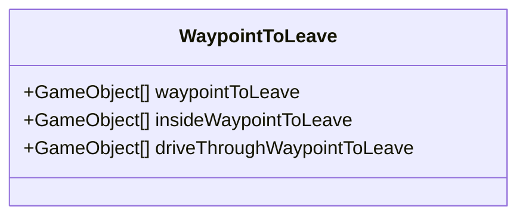

# AlienDiner
Aliens in een Diner

In deze repository vind je de informatie over het examen project.

Omschrijf de examenopdracht evt de klant en wat het doel voor de klant is.
Omschrijf ook beknopt wat het idee van je game is. 
Een complete en uitgebreide beschrijving komt in het functioneel ontwerp (onderdeel van de [wiki](https://github.com/erwinhenraat/VoorbeeldExamenRepo/wiki))

# Geproduceerde Game Onderdelen

Geef per teammember aan welke game onderdelen je hebt geproduceerd. Doe dit met behulp van omschrijvingen visual sheets en screenshots.
Maak ook een overzicht van alle onderdelen met een link naar de map waarin deze terug te vinden zijn.

Bijv..

Gino Schaap:
  * [Customer Types](https://github.com/TheGingino/AlienDiner/blob/Develop/AlienDinerDash/Assets/Scripts/Customer/CustomerSO.cs)
  * [Customer Spawning](https://github.com/TheGingino/AlienDiner/blob/Develop/AlienDinerDash/Assets/Scripts/Customer/CustomerSpawner.cs)
  * [DriveThrough Customer Spawning](https://github.com/TheGingino/AlienDiner/blob/Develop/AlienDinerDash/Assets/Scripts/Customer/DriveThroughCustomer.cs)
  * [Customer Behavior](https://github.com/TheGingino/AlienDiner/blob/Develop/AlienDinerDash/Assets/Scripts/Customer/Customer.cs)
  * [LevelTimer V2](https://github.com/TheGingino/AlienDiner/blob/Develop/AlienDinerDash/Assets/Scripts/Customer/Customer.cs)
  * [WinLoseScreen](https://github.com/TheGingino/AlienDiner/blob/Develop/AlienDinerDash/Assets/Scripts/Customer/Customer.cs)

Julie Jaasma:
  * [Some beautifull script](https://github.com/erwinhenraat/VoorbeeldExamenRepo/tree/master/src/beautifull)
  * Some other Game object

Nikki van Wijngaarden:
 * Audio
 * 
Kiana Hiemstra:
  * Water Shader
  * [Some textured and rigged model](https://github.com/erwinhenraat/VoorbeeldExamenRepo/tree/master/assets/monsters)

Bo Bakker:
 * Character Model
 * Customer Models

Robin van Wandelen:
 * UI Shenan
 * 

 Gui
 * IDK

Min van der Veen:
 * Keuken Instrumenten

## Customers and Customer SO

Latin professor at Hampden-Sydney College in Virginia, looked up one of the more obscure Latin words, consectetur, from a Lorem Ipsum passage, and going through the cites of the word in classical literature, discovered the undoubtable source. Lorem Ipsum comes from sections 1.10.32 and 1.10.33 of "de Finibus Bonorum et Malorum" (The Extremes of Good and Evil) by Cicero, written in 45 BC. This book is a treatise on the theory of ethics, very popular during the Renaissance. The first line of Lorem Ipsum, "Lorem ipsum dolor sit amet..", comes from a line.

### flowchart voor CustomerSO:

### Flowchart Customer

### class diagram voor game entities:

### Class Diagram voor Reward System

## Some other Mechanic X by Student X

Contrary to popular belief, Lorem Ipsum is not simply random text. It has roots in a piece of classical Latin literature from 45 BC, making it over 2000 years old. Richard McClintock, a Latin professor at Hampden-Sydney College in Virginia, looked up one of the more obscure Latin words, consectetur, from a Lorem Ipsum passage, and going through the cites of the word in classical literature, discovered the undoubtable source. Lorem Ipsum comes from sections 1.10.32 and 1.10.33 of "de Finibus Bonorum et Malorum" (The Extremes of Good and Evil) by Cicero, written in 45 BC. This book is a treatise on the theory of ethics, very popular during the Renaissance. The first line of Lorem Ipsum, "Lorem ipsum dolor sit amet..", comes from a line in section 1.10.32.

## Some other Mechanic Y by Student X

Contrary to popular belief, Lorem Ipsum is not simply random text. It has roots in a piece of classical Latin literature from 45 BC, making it over 2000 years old. Richard McClintock, a Latin professor at Hampden-Sydney College in Virginia, looked up one of the more obscure Latin words, consectetur, from a Lorem Ipsum passage, and going through the cites of the word in classical literature, discovered the undoubtable source. Lorem Ipsum comes from sections 1.10.32 and 1.10.33 of "de Finibus Bonorum et Malorum" (The Extremes of Good and Evil) by Cicero, written in 45 BC. This book is a treatise on the theory of ethics, very popular during the Renaissance. The first line of Lorem Ipsum, "Lorem ipsum dolor sit amet..", comes from a line in section 1.10.32.

## Water Shader by Student Y

Contrary to popular belief, Lorem Ipsum is not simply random text. It has roots in a piece of classical Latin literature from 45 BC, making it over 2000 years old. Richard McClintock, a Latin professor at Hampden-Sydney College in Virginia, looked up one of the more obscure Latin words, consectetur, from a Lorem Ipsum passage, and going through the cites of the word in classical literature, discovered the undoubtable source. Lorem Ipsum comes from sections 1.10.32 and 1.10.33 of "de Finibus Bonorum et Malorum" (The Extremes of Good and Evil) by Cicero, written in 45 BC. This book is a treatise on the theory of ethics, very popular during the Renaissance. The first line of Lorem Ipsum, "Lorem ipsum dolor sit amet..", comes from a line in section 1.10.32.

## Some textured and rigged model by Student Y

Contrary to popular belief, Lorem Ipsum is not simply random text. It has roots in a piece of classical Latin literature from 45 BC, making it over 2000 years old. Richard McClintock, a Latin professor at Hampden-Sydney College in Virginia, looked up one of the more obscure Latin words, consectetur, from a Lorem Ipsum passage, and going through the cites of the word in classical literature, discovered the undoubtable source. Lorem Ipsum comes from sections 1.10.32 and 1.10.33 of "de Finibus Bonorum et Malorum" (The Extremes of Good and Evil) by Cicero, written in 45 BC. This book is a treatise on the theory of ethics, very popular during the Renaissance. The first line of Lorem Ipsum, "Lorem ipsum dolor sit amet..", comes from a line in section 1.10.32.

## Some beautifull script by Student Z

Contrary to popular belief, Lorem Ipsum is not simply random text. It has roots in a piece of classical Latin literature from 45 BC, making it over 2000 years old. Richard McClintock, a Latin professor at Hampden-Sydney College in Virginia, looked up one of the more obscure Latin words, consectetur, from a Lorem Ipsum passage, and going through the cites of the word in classical literature, discovered the undoubtable source. Lorem Ipsum comes from sections 1.10.32 and 1.10.33 of "de Finibus Bonorum et Malorum" (The Extremes of Good and Evil) by Cicero, written in 45 BC. This book is a treatise on the theory of ethics, very popular during the Renaissance. The first line of Lorem Ipsum, "Lorem ipsum dolor sit amet..", comes from a line in section 1.10.32.

## Some other Game object by Student Z

Contrary to popular belief, Lorem Ipsum is not simply random text. It has roots in a piece of classical Latin literature from 45 BC, making it over 2000 years old. Richard McClintock, a Latin professor at Hampden-Sydney College in Virginia, looked up one of the more obscure Latin words, consectetur, from a Lorem Ipsum passage, and going through the cites of the word in classical literature, discovered the undoubtable source. Lorem Ipsum comes from sections 1.10.32 and 1.10.33 of "de Finibus Bonorum et Malorum" (The Extremes of Good and Evil) by Cicero, written in 45 BC. This book is a treatise on the theory of ethics, very popular during the Renaissance. The first line of Lorem Ipsum, "Lorem ipsum dolor sit amet..", comes from a line in section 1.10.32.

